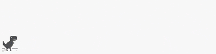

<h1 align="center">✦ Zer0shiroo ✦</h1>
<p align="center">Creative Developer | Digital Minimalist | 🇪🇸</p>

---



### 🧠 About Me

```yaml
Name: Zer0shiroo
Location: Spain
Languages: JavaScript, TypeScript, HTML/CSS, Node.js, PHP
Interests: web development, UI/UX design, chillwave music, dark terminal
Currently: exploring new ways to build intuitive and clean web experiences
````

---

### 💼 Skills & Tools

<p align="center"> 
   
   
   
   
   
   
   
   
</p>

### 🌱 Currently Learning

* Diving deeper into Electron.js
* Redesigning some personal projects
* Experimenting with new ways to document with my own style

---


---


